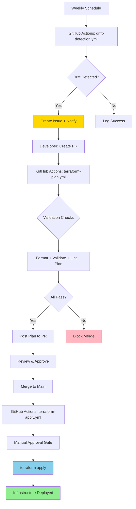

# CI/CD Pipeline — GitHub Actions + Terraform

A production-grade CI/CD pipeline demonstrating automated infrastructure deployment, drift detection, and safe teardown practices using GitHub Actions and Terraform.

**Built for:** AU/NZ DevOps/Cloud Engineer job applications
**Portfolio by:** Justin Henson ([GitHub](https://github.com/justin-henson))

---

## What This Demonstrates

Most candidates can run `terraform apply` locally. This repository proves I can build and operate a complete CI/CD pipeline that:

- ✅ **Automates infrastructure testing** - Format checks, validation, linting, and planning on every PR
- ✅ **Enforces review processes** - Manual approval gates before production changes
- ✅ **Detects configuration drift** - Weekly automated checks with notifications and issue creation
- ✅ **Implements safe destruction** - Multi-gate teardown workflow with audit trail
- ✅ **Follows production patterns** - State management, concurrency controls, artifact handling
- ✅ **Integrates with GitHub ecosystem** - PR comments, commit statuses, environment protection

This is the pipeline that would deploy the infrastructure from my [au-nz-cloud-baseline-aws](https://github.com/justin-henson/au-nz-cloud-baseline-aws) repository, following the operational procedures in [au-nz-ops-runbooks](https://github.com/justin-henson/au-nz-ops-runbooks).

---

## Quick Review (60 seconds for hiring managers)

**Want to see the code that matters most?**

1. **Pipeline workflows** (the differentiator):
   - [`.github/workflows/terraform-plan.yml`](.github/workflows/terraform-plan.yml) - PR validation and planning
   - [`.github/workflows/drift-detection.yml`](.github/workflows/drift-detection.yml) - Automated drift detection ⭐ *Most candidates don't show this*

2. **Infrastructure code**:
   - [`terraform/main.tf`](terraform/main.tf) - Root module composition
   - [`terraform/modules/app-stack/`](terraform/modules/app-stack/) - Reusable infrastructure module

3. **Documentation**:
   - [`docs/PIPELINE-ARCHITECTURE.md`](docs/PIPELINE-ARCHITECTURE.md) - Full pipeline flow with Mermaid diagram
   - [`docs/DECISION-LOG.md`](docs/DECISION-LOG.md) - Why I made specific architectural choices

**tl;dr:** This isn't just Terraform code. It's a complete CI/CD system with testing, drift detection, and operational safety.

---

## Architecture Overview



**Key Flows:**

1. **PR Flow**: Developer creates PR → Automated checks run → Plan posted to PR → Review → Merge → Manual approval → Apply
2. **Drift Detection**: Weekly scheduled check → If drift detected → Create GitHub issue + Send notifications → Team investigates
3. **Destroy Flow**: Manual trigger only → Require typed confirmation → Execute teardown → Create audit issue

See [PIPELINE-ARCHITECTURE.md](docs/PIPELINE-ARCHITECTURE.md) for detailed architecture documentation.

---

## Repository Structure

```
au-nz-cicd-pipeline/
├── .github/workflows/
│   ├── terraform-plan.yml        # PR validation and planning
│   ├── terraform-apply.yml       # Post-merge deployment with approval
│   ├── drift-detection.yml       # Weekly drift detection (the differentiator!)
│   └── destroy.yml               # Safe infrastructure teardown
├── terraform/
│   ├── main.tf                   # Root module composition
│   ├── variables.tf              # Input variables with validation
│   ├── outputs.tf                # Deployment outputs
│   ├── backend.tf                # S3+DynamoDB state config (with setup instructions)
│   ├── providers.tf              # AWS provider configuration
│   ├── versions.tf               # Version constraints
│   └── modules/
│       └── app-stack/            # Reusable module: SG + EC2 + outputs
├── scripts/
│   ├── plan-summary.sh           # Parse and format plan output
│   └── notify-drift.sh           # Send drift notifications (Slack/email)
├── docs/
│   ├── PIPELINE-ARCHITECTURE.md  # Detailed pipeline design with Mermaid diagrams
│   ├── DECISION-LOG.md           # Architectural decisions and trade-offs
│   └── RUNBOOK-PIPELINE-FAILURE.md # Troubleshooting guide
└── examples/
    └── sample-pr-output.md       # Example PR comment from terraform plan
```

---

## How to Fork & Run

Want to test this pipeline yourself? Follow these steps:

### Prerequisites

- GitHub account with Actions enabled
- AWS account with programmatic access
- Basic familiarity with Terraform and GitHub Actions

### Setup Steps

**1. Fork this repository**

Click the "Fork" button at the top of this page.

**2. Configure AWS credentials**

Create AWS IAM user with these permissions (or use AdministratorAccess for testing):
```json
{
  "Version": "2012-10-17",
  "Statement": [
    {
      "Effect": "Allow",
      "Action": [
        "ec2:*",
        "iam:GetRole",
        "iam:PassRole"
      ],
      "Resource": "*"
    }
  ]
}
```

Generate access key for the user.

**3. Add GitHub secrets**

In your forked repository:
- Go to **Settings → Secrets and variables → Actions → Secrets**
- Click **New repository secret** and add:
  - `AWS_ACCESS_KEY_ID`: Your AWS access key ID
  - `AWS_SECRET_ACCESS_KEY`: Your AWS secret access key
  - `SLACK_WEBHOOK_URL`: (Optional) For drift notifications

**4. Configure GitHub Environments**

- Go to **Settings → Environments**
- Create environment: `production`
  - Add required reviewers (yourself or team members)
  - This enables the manual approval gate for applies

**5. Create a test PR**

```bash
git clone https://github.com/justin-henson/au-nz-cicd-pipeline.git
cd au-nz-cicd-pipeline

# Create a test branch
git checkout -b test-pipeline

# Make a small change to trigger the workflow
echo "# Test change" >> terraform/main.tf

git add .
git commit -m "test: Trigger pipeline workflow"
git push origin test-pipeline
```

**6. Create PR on GitHub**

- Go to your forked repository
- Click "Compare & pull request"
- Watch the `terraform-plan.yml` workflow run
- Review the plan posted as a PR comment

**7. Merge and observe apply**

- Merge the PR
- The `terraform-apply.yml` workflow will run
- **Approve the deployment** when prompted (in the Actions tab)
- Infrastructure will be deployed to your AWS account

**8. Test drift detection**

```bash
# Manually trigger drift detection
# Go to Actions → drift-detection.yml → Run workflow
```

**9. Clean up**

```bash
# Manually trigger destroy workflow
# Go to Actions → destroy.yml → Run workflow
# Enter "DESTROY-CONFIRMED" when prompted
# Provide a reason (e.g., "Cleaning up test infrastructure")
```

---

## Design Decisions

Key architectural choices and their rationale:

### Why GitHub Actions?

Native integration with GitHub, no external service required, widely adopted in AU/NZ tech companies. See [DECISION-LOG.md](docs/DECISION-LOG.md#decision-1-github-actions-vs-gitlab-ci-vs-jenkins) for full analysis.

### Why Plan Artifacts with Fallback?

Ensures reviewed plan matches applied changes, but doesn't block deployments if artifacts expire. See [DECISION-LOG.md](docs/DECISION-LOG.md#decision-2-plan-artifact-vs-re-plan-on-apply).

### Why Scheduled Drift Detection?

Predictable resource usage, simple implementation, catches drift before it accumulates. Real-time detection adds complexity without much benefit for most workloads. See [DECISION-LOG.md](docs/DECISION-LOG.md#decision-3-drift-detection-approach-scheduled-vs-event-driven).

### Why S3+DynamoDB for State?

Self-contained in your AWS account, no external dependencies, industry standard for AWS-based teams. See [DECISION-LOG.md](docs/DECISION-LOG.md#decision-4-state-management-strategy-s3dynamodb-vs-terraform-cloud).

**Read the full decision log:** [docs/DECISION-LOG.md](docs/DECISION-LOG.md)

---

## Connects To

This pipeline integrates with my other AU/NZ portfolio repositories:

### [au-nz-cloud-baseline-aws](https://github.com/justin-henson/au-nz-cloud-baseline-aws)

**Relationship:** This CI/CD pipeline would deploy the AWS foundation defined in the baseline repository.

**How they connect:**
- Baseline defines the "what" (VPC, subnets, security groups, IAM roles)
- This pipeline defines the "how" (automated testing, deployment, drift detection)
- In production, you'd point this pipeline at the baseline Terraform code

**Integration point:** Update `terraform/` directory to reference baseline modules.

### [au-nz-ops-runbooks](https://github.com/justin-henson/au-nz-ops-runbooks)

**Relationship:** When this pipeline fails, you'd follow the operational procedures in the runbooks repository.

**How they connect:**
- This repo includes [RUNBOOK-PIPELINE-FAILURE.md](docs/RUNBOOK-PIPELINE-FAILURE.md)
- That runbook references general procedures from ops-runbooks
- Shows understanding of incident response and operational handoffs

**Integration point:** Links in runbook to escalation procedures and AWS troubleshooting guides.

---

## Skills Demonstrated

This repository showcases:


**Technical Skills:**
- Terraform module design and composition
- GitHub Actions workflow development
- AWS infrastructure management (EC2, Security Groups)
- Bash scripting for automation
- YAML for CI/CD configuration
- Git branching and PR workflows

**DevOps Practices:**
- Automated testing and validation
- Infrastructure drift detection and remediation
- Manual approval gates for production changes
- Audit trails and compliance documentation
- Runbook creation for operational support
- Architectural decision documentation

**AU/NZ Market Alignment:**
- Production-grade practices (not just toy examples)
- Clear documentation for team collaboration
- Operational thinking (drift detection, runbooks, incident response)
- Cost-conscious design (t3.micro, scheduled checks, artifact retention)
- Security considerations (approval gates, secret management, CIDR restrictions)

---

## AU/NZ Context

This repository is specifically designed for **Australia and New Zealand DevOps/Cloud Engineer roles**.

**Why this matters to AU/NZ employers:**

1. **Cloud maturity**: AU/NZ companies are increasingly adopting Infrastructure-as-Code and GitOps practices. This shows I'm aligned with modern practices.

2. **Operational excellence**: AU/NZ engineering teams value operational thinking - not just building things, but maintaining them. The drift detection and runbooks demonstrate this mindset.

3. **Team collaboration**: AU/NZ companies emphasize collaborative engineering. The PR workflows, approval gates, and documentation show I understand team-based development.

4. **Cost consciousness**: AU/NZ companies often have tighter budgets than US counterparts. This pipeline uses cost-effective approaches (scheduled checks, minimal resources, AWS Sydney region).

**Region-specific considerations:**
- Default AWS region: `ap-southeast-2` (Sydney)
- Drift detection scheduled for Monday 9 AM AEST
- Documentation uses AU/NZ English spelling and terminology

**Target roles:**
- DevOps Engineer
- Cloud Engineer
- Infrastructure Engineer
- Platform Engineer
- Site Reliability Engineer (SRE)

If you're hiring for one of these roles in AU/NZ, [let's talk](https://github.com/justin-henson)!

---

## What's Next?

**For this portfolio:**
- ✅ Complete CI/CD pipeline with drift detection
- ✅ Comprehensive documentation and runbooks
- ✅ Integration with other portfolio repositories

**For production use:**
- [ ] Configure S3+DynamoDB backend for remote state
- [ ] Set up Slack webhook for drift notifications
- [ ] Add environment-specific variable files (dev, staging, prod)
- [ ] Implement policy-as-code with Sentinel or OPA
- [ ] Add automated testing with Terratest
- [ ] Set up cost tracking and optimization alerts

---

## Documentation

- [PIPELINE-ARCHITECTURE.md](docs/PIPELINE-ARCHITECTURE.md) - Detailed pipeline design with Mermaid diagrams
- [DECISION-LOG.md](docs/DECISION-LOG.md) - Architectural decisions and trade-offs
- [RUNBOOK-PIPELINE-FAILURE.md](docs/RUNBOOK-PIPELINE-FAILURE.md) - Troubleshooting guide
- [sample-pr-output.md](examples/sample-pr-output.md) - Example PR comment from plan workflow

---

## License

MIT License - See [LICENSE](LICENSE) for details.

This repository is intended as a portfolio demonstration. Feel free to use it as a reference or template for your own CI/CD pipelines.

---

## Contact

**Justin Henson**
GitHub: [@justin-henson](https://github.com/justin-henson)

**Looking for DevOps/Cloud Engineers in AU/NZ?** I'm actively seeking opportunities in Australia and New Zealand. Check out my other repositories:
- [au-nz-cloud-baseline-aws](https://github.com/justin-henson/au-nz-cloud-baseline-aws) - AWS foundation infrastructure
- [au-nz-ops-runbooks](https://github.com/justin-henson/au-nz-ops-runbooks) - Operational procedures and troubleshooting guides

---

*Built with ☕ for AU/NZ DevOps opportunities*
