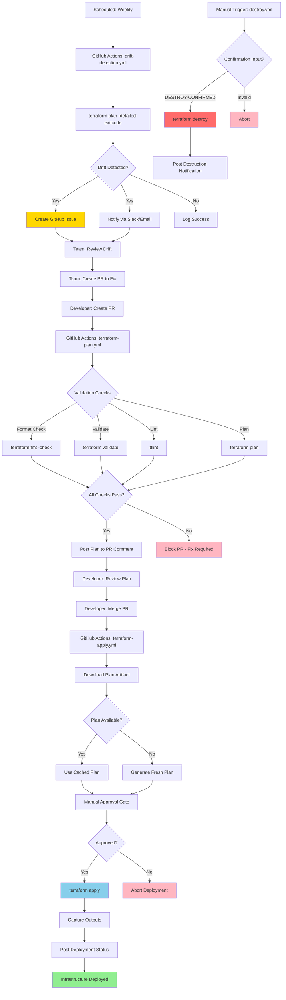

# Pipeline Architecture

This document describes the CI/CD pipeline architecture and workflow for the `au-nz-cicd-pipeline` project.

## Architecture Overview



## Pipeline Stages

### 1. Plan Stage (Pull Request)

**Trigger:** Pull request to `main` branch

**Workflow:** `.github/workflows/terraform-plan.yml`

**Steps:**
1. **Code checkout** - Fetch PR branch code
2. **Terraform setup** - Install specific Terraform version
3. **Format check** - Ensure code follows Terraform style (`terraform fmt -check`)
4. **Initialize** - Set up Terraform backend and providers
5. **Validate** - Check configuration syntax and references
6. **Lint** - Run TFLint for additional checks (security, best practices)
7. **Plan** - Generate execution plan showing proposed changes
8. **Parse output** - Extract change statistics (creates/updates/destroys)
9. **Upload artifact** - Save plan file for apply stage
10. **Comment on PR** - Post formatted plan summary to pull request

**Key Features:**
- Concurrency control prevents parallel plans on same PR
- All checks must pass before merge is allowed
- Plan artifact stored for 5 days
- Human-readable summary posted directly to PR

**Why This Matters:**
Catching errors before merge saves time and prevents broken deployments. Reviewers can see exactly what will change before approving.

---

### 2. Apply Stage (Post-Merge)

**Trigger:** Push to `main` branch (after PR merge)

**Workflow:** `.github/workflows/terraform-apply.yml`

**Steps:**
1. **Code checkout** - Fetch merged code from main
2. **Terraform setup** - Install Terraform
3. **Initialize** - Set up backend and providers
4. **Download plan artifact** - Attempt to use cached plan from PR
5. **Fallback strategy** - If artifact expired, generate fresh plan
6. **Manual approval gate** - Wait for human approval via GitHub Environments
7. **Apply** - Execute Terraform changes with approved plan
8. **Capture outputs** - Save deployment results (IPs, resource IDs, etc.)
9. **Post status** - Comment on commit with deployment results

**Key Features:**
- Uses GitHub Environments for approval workflow
- Gracefully handles expired plan artifacts
- Captures and stores deployment outputs
- Posts deployment status to commit

**Why This Matters:**
Manual approval gate prevents accidental deployments of destructive changes. Using cached plan ensures what was reviewed is what gets applied.

---

### 3. Drift Detection Stage (Scheduled)

**Trigger:** Weekly schedule (Monday 9 AM AEST) + manual dispatch

**Workflow:** `.github/workflows/drift-detection.yml`

**Steps:**
1. **Code checkout** - Fetch current main branch
2. **Terraform setup** - Install Terraform
3. **Initialize** - Set up backend and providers
4. **Drift check** - Run `terraform plan -detailed-exitcode`
   - Exit code 0: No drift detected
   - Exit code 1: Error occurred
   - Exit code 2: Drift detected (changes exist)
5. **Parse drift details** - Extract affected resources
6. **Notify stakeholders** - Send Slack/email notifications
7. **Create GitHub issue** - Auto-create issue with drift details
8. **Update existing issue** - If open drift issue exists, add comment instead

**Key Features:**
- Uses `-detailed-exitcode` to distinguish between "no changes" and "drift detected"
- Creates comprehensive GitHub issues with actionable steps
- Avoids duplicate issues by checking for existing open drift issues
- Sends notifications via configurable channels (Slack webhook)

**Why This Matters:**
Most candidates don't demonstrate drift detection. This shows you understand that infrastructure can change outside Terraform (manual console changes, AWS auto-scaling, etc.) and have a process to detect and handle it.

---

### 4. Destroy Stage (Manual)

**Trigger:** Manual workflow dispatch only

**Workflow:** `.github/workflows/destroy.yml`

**Steps:**
1. **Validate confirmation** - Require typed input "DESTROY-CONFIRMED"
2. **Require reason** - Mandate destruction reason for audit trail
3. **Log request** - Record who, what, when, why
4. **Code checkout** - Fetch main branch
5. **Terraform setup** - Install Terraform
6. **Initialize** - Set up backend and providers
7. **Plan destroy** - Show what will be destroyed
8. **Manual approval** - Wait for environment approval (if configured)
9. **Execute destroy** - Run `terraform destroy -auto-approve`
10. **Upload logs** - Save destruction logs for 90-day retention
11. **Create audit issue** - Document destruction for compliance

**Key Features:**
- Multiple safety gates (typed confirmation, reason field, environment approval)
- 90-day log retention for audit compliance
- Automatic issue creation for audit trail
- Cannot be triggered accidentally (workflow_dispatch only)

**Why This Matters:**
Production destruction should never be easy. This workflow demonstrates understanding of safe teardown practices and audit requirements.

---

## Concurrency and State Management

### Concurrency Controls

```yaml
concurrency:
  group: terraform-plan-${{ github.event.pull_request.number }}
  cancel-in-progress: false
```

- Prevents simultaneous plan operations on the same PR
- Ensures plan artifacts aren't overwritten mid-operation
- Does not cancel in-progress runs (better to finish and show results)

### State Management

**Demo Configuration:**
- Uses local state (default)
- Each workflow run gets isolated state
- Acceptable for portfolio demo, **NOT for production**

**Production Configuration:**
- S3 backend for remote state storage
- DynamoDB for state locking
- Versioning enabled on S3 bucket
- Server-side encryption for sensitive data
- Configuration instructions in `backend.tf`

---

## Integration Points

### GitHub Secrets Required

Configure these in **Settings → Secrets and variables → Actions → Secrets**:

- `AWS_ACCESS_KEY_ID` - AWS credentials for Terraform
- `AWS_SECRET_ACCESS_KEY` - AWS credentials for Terraform
- `SLACK_WEBHOOK_URL` - (Optional) For drift notifications

**Production Best Practice:** Use OIDC authentication instead of long-lived credentials. See [GitHub's OIDC documentation](https://docs.github.com/en/actions/deployment/security-hardening-your-deployments/configuring-openid-connect-in-amazon-web-services).

### GitHub Environments

Create these environments in **Settings → Environments**:

- `production` - Used by terraform-apply.yml
  - Add required reviewers (1-6 people)
  - Add deployment protection rules
- `production-destroy` - Used by destroy.yml
  - Add required reviewers
  - Extra protection layer for destructive operations

---

## Monitoring and Observability

### Workflow Artifacts

- **Plan files**: Stored for 5 days (PR plans)
- **Outputs**: Stored for 30 days (deployment results)
- **Destroy logs**: Stored for 90 days (compliance/audit)

### Notifications

- **PR comments**: Plan summaries posted automatically
- **Commit comments**: Apply results posted to merged commits
- **GitHub Issues**: Created for drift detection and destroy operations
- **Slack/Email**: Drift notifications (configurable)

### Audit Trail

Every operation creates an auditable record:
- Workflow runs with full logs
- GitHub issues for drift/destroy
- Commit comments linking to workflow runs
- Artifact storage with retention policies

---

## Failure Handling

See [RUNBOOK-PIPELINE-FAILURE.md](./RUNBOOK-PIPELINE-FAILURE.md) for detailed failure scenarios and remediation steps.

Common failure modes:
- Plan validation failures → Fix in PR before merge
- Apply failures → Review logs, may need manual intervention
- Drift detection failures → Check AWS credentials and connectivity
- Destroy failures → May require manual resource cleanup

---

## Key Differentiators

What makes this pipeline production-grade:

1. **Automated Drift Detection** - Weekly checks with auto-issue creation
2. **Plan Artifacts** - Ensures reviewed plan matches applied changes
3. **Manual Approval Gates** - Human checkpoint before production changes
4. **Comprehensive Notifications** - Multiple channels for different audiences
5. **Audit Trail** - Full logging and issue tracking for compliance
6. **Safe Destruction** - Multiple gates to prevent accidental teardown
7. **Modular Design** - Reusable Terraform modules
8. **Code Quality Gates** - Format, validate, lint all enforced in CI

---

## Related Documentation

- [DECISION-LOG.md](./DECISION-LOG.md) - Architectural decisions and trade-offs
- [RUNBOOK-PIPELINE-FAILURE.md](./RUNBOOK-PIPELINE-FAILURE.md) - Troubleshooting guide
- [au-nz-cloud-baseline-aws](https://github.com/justin-henson/au-nz-cloud-baseline-aws) - AWS foundation this pipeline would deploy
- [au-nz-ops-runbooks](https://github.com/justin-henson/au-nz-ops-runbooks) - Operational procedures
